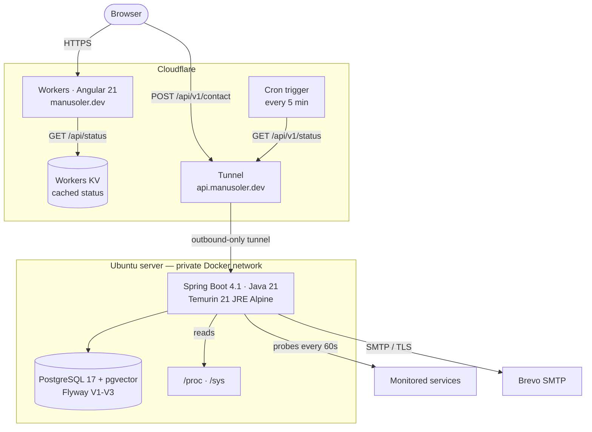

<div align="center">

# Portfolio - API

**Spring Boot service behind [manusoler.dev](https://manusoler.dev)**

Contact delivery, homelab monitoring and host telemetry for my portfolio site,
running on my own server behind a Cloudflare Tunnel.

<br>

[](https://manusoler.dev)
[](https://api.manusoler.dev/actuator/health)
[](https://github.com/ManusolJ/portfolio-web)

[](https://openjdk.org/)
[](https://spring.io/projects/spring-boot)
[](https://www.postgresql.org/)
[](https://github.com/pgvector/pgvector)
[](https://flywaydb.org/)
[](https://www.docker.com/)
[](https://www.cloudflare.com/)

[](https://github.com/ManusolJ/portfolio-api/actions)
[](https://github.com/ManusolJ/portfolio-api/commits)

<a href="#why-it-exists">Why it exists</a> ·
<a href="#what-it-does">What it does</a> ·
<a href="#architecture">Architecture</a> ·
<a href="#design-decisions">Design decisions</a> ·
<a href="#api-overview">API</a> ·
<a href="#running-it-locally">Running it</a> ·
<a href="#testing">Testing</a> ·
<a href="#deployment">Deployment</a> ·
<a href="#project-status-and-roadmap">Roadmap</a>

</div>

---

## Why it exists

A portfolio site is a static page, and a static page says nothing about whether its author
can run a service. This API is the part of the portfolio that is actually operated: it
lives on a machine I own, it is reachable from the internet, and the site reports in public
whether it is healthy.

It also solves a real problem for the site. A contact form needs a server to send mail, and
a status panel needs somewhere to keep history. Both are small; the interesting part is
everything around them - how a home server is exposed safely, how it degrades when it is
switched off, and how its uptime is reported honestly rather than flatteringly.

---

## What it does

### Contact delivery

Validated submissions from the site's contact form are sent over SMTP to my inbox, with the
visitor's address in `Reply-To` so answering is one click. Abuse is handled in layers: a
honeypot field on the page, a per-IP token bucket in the service, and a Cloudflare rate
rule in front of both.

### Service monitoring

A scheduled job probes each configured service every 60 seconds and records whether it
answered, how quickly, and with which status code. Each check writes three things: a raw row
for the latency sparkline, a running daily rollup for the 90-day bars, and an incident row
when the state changes from up to down or back. Probe targets come from configuration only.

### Host telemetry

A second job samples the machine itself every 60 seconds - CPU, memory, disk, load average,
uptime and temperature - by parsing `/proc` and `/sys` directly, with no agent and no
third-party service.

### Status endpoint

`GET /api/v1/status` composes all of it into one document: current state per service, uptime
over 7/30/90 days, 90 daily bars, the most recent incident, and the host's vitals with a day
of five-minute averages. It only reads stored rows; nothing is probed inside a request.

---

## Architecture



The site never calls the status endpoint directly. A Cloudflare Worker polls it every five
minutes and caches the answer in KV, so the panel keeps rendering - with an explicit
"unreachable since" line - even while the server is off.

### Layering

```
config/        CORS, RestClient, Clock, @ConfigurationProperties records
contact/       POST /api/v1/contact, SMTP delivery
interceptor/   per-IP rate limiting
ratelimiter/   token buckets (bucket4j + Caffeine)
monitor/       scheduled probes, checks, rollups, incidents
telemetry/     /proc parsing, host sampler
status/        GET /api/v1/status, composed from stored rows
search/        CV semantic search (planned)
```

One package per feature rather than a `controllers/` + `services/` split: each folder holds
its controller, service, repository and records, so a feature is one directory.

---

## Design decisions

### Probe targets come from configuration and never from a request

Letting anyone fetch data from the local machine on demand would mean that anyone can use
this service to scan the private network it sits inside, with latency alone
distinguishing a closed port from a filtered one. Services are declared in
`app.monitor.services`, and the probe loop runs on a schedule.

### Uptime divides by expected checks, not recorded ones

A monitor running on the machine it watches cannot observe its own host going down - the
outage appears as missing rows. Dividing successes by _recorded_ checks would report 100%
for a day the server spent switched off. Each day is therefore scored against the number of
checks that were due (`86400 / interval`), and days with fewer checks than expected are
flagged so the panel can label the gap instead of hiding it.

### The current day is scored against elapsed time

Expecting a full day of checks from a day in progress would show every morning as an
outage, so today is measured against the checks due so far.

### Incidents are state transitions, held by the database

The open incident row _is_ the state. Going down inserts a row guarded by a partial unique
index (`WHERE ended_at IS NULL`), so repeated failures cannot open a second one; recovery
closes it. There is no in-memory flag to lose on restart, and the affected-row count tells
the service whether a transition actually happened, so logs fire once per event.

### Spring Data JDBC instead of JPA

Two append-only tables and a rollup. No object graph, no lazy loading, nothing to dirty-check -
`JdbcClient` with explicit SQL says what runs, and the application starts in about three
seconds on a machine that also runs Postgres and Ollama.

### Rate limiting keyed on `CF-Connecting-IP`

Behind a tunnel, `getRemoteAddr()` is the tunnel itself, so every visitor would share one
bucket. `X-Forwarded-For` is no better: Cloudflare appends to it, so its first entry is
caller-supplied and spoofable. `CF-Connecting-IP` is set by Cloudflare and overwrites
anything the client sends.

### A Cloudflare Tunnel, not a port forward

The server opens an outbound connection and nothing is exposed inbound; the firewall has no
hole and the home IP address stays private.

---

## API overview

| Method | Path               | Purpose                                | Protection                                     |
| ------ | ------------------ | -------------------------------------- | ---------------------------------------------- |
| `POST` | `/api/v1/contact`  | Send a contact message                 | Bean validation, honeypot, 5/hour per IP       |
| `GET`  | `/api/v1/status`   | Host vitals, service uptime, incidents | Polled by the edge worker only                 |
| `GET`  | `/actuator/health` | Liveness and readiness                 | Every other actuator endpoint is 404 by design |

CORS is restricted to the site's origin. `POST /api/v1/cv/search` is planned - see the
[roadmap](#project-status-and-roadmap).

---

## Tech stack

| Layer         | Choice                                                       |
| ------------- | ------------------------------------------------------------ |
| Language      | Java 21                                                      |
| Framework     | Spring Boot 4.1, Spring MVC on Tomcat, virtual threads       |
| Persistence   | Spring Data JDBC, PostgreSQL 17 with pgvector, Flyway        |
| AI            | Spring AI 2.0 - Ollama embeddings (`bge-m3`), pgvector store |
| Mail          | Spring Mail over Brevo SMTP                                  |
| Rate limiting | bucket4j, Caffeine-bounded bucket cache                      |
| Tests         | JUnit 5, AssertJ, Mockito, Testcontainers                    |
| Formatting    | Spotless with an Eclipse profile                             |
| Runtime       | Docker, Docker Compose, Cloudflare Tunnel                    |

---

## Running it locally

Requires JDK 21 and Docker (the integration test starts a real Postgres).

```bash
git clone https://github.com/ManusolJ/portfolio-api.git
cd portfolio-api
cp .env.example .env
```

Fill in `.env`, then start a database and the application:

```bash
docker compose -f docker-compose.prod.yml up -d postgres
./mvnw spring-boot:run
```

`curl localhost:8080/actuator/health` should answer `{"status":"UP"}`.

### Environment variables

| Variable                                               | Purpose                                      |
| ------------------------------------------------------ | -------------------------------------------- |
| `DB_URL`, `DB_USER`, `DB_PASSWORD`                     | Database connection                          |
| `POSTGRES_DB`, `POSTGRES_USER`, `POSTGRES_PASSWORD`    | Read by the Postgres container on first boot |
| `MAIL_HOST`, `MAIL_PORT`, `MAIL_USER`, `MAIL_PASSWORD` | SMTP credentials                             |
| `MAIL_FROM`, `CONTACT_TO`                              | Sender and destination for contact mail      |
| `CORS_ALLOWED_ORIGIN`                                  | Origin allowed to call the API               |
| `MONITOR_ENABLED`                                      | Turns the service probes on (off by default) |
| `TELEMETRY_ENABLED`, `DISK_PATH`, `THERMAL_PATH`       | Host sampling; `THERMAL_PATH` is optional    |
| `OLLAMA_URL`                                           | Embedding server, for the planned search     |

---

## Testing

```bash
./mvnw -B spotless:check verify
```

23 tests. The suite is deliberately split by what it needs:

- **Pure logic, no Spring** - `/proc` parsing against fixtures captured from a real Linux
  host, uptime arithmetic against a pinned clock, rate-limit buckets driven through mock
  servlet requests. These run in milliseconds.
- **One collaborator faked** - `MockRestServiceServer` scripts a fake origin so the probe's
  three outcomes (2xx, non-2xx, no response at all) are tested without a network.
- **The whole context** - `PortfolioApplicationTests` boots against a throwaway
  `pgvector/pgvector:pg17` container via Testcontainers, so the migrations run for real on
  every build.

Docker Desktop must be running or the context test fails before any assertion does.

---

## Deployment

Pushing to `main` runs CI; a successful build triggers a deploy over SSH through the
Cloudflare Tunnel, which pulls the repository on the server and runs `deploy.sh`. That
rebuilds the image, restarts the stack and waits for the health check before declaring
success.

```
GitHub Actions ──SSH over Tunnel──> lorelei-server
                                      └── docker compose up -d --build
                                            ├── portfolio-api   (127.0.0.1:8081)
                                            └── homelab-db      (private network only)
```

The application binds to loopback only; the tunnel is the sole ingress. The database is
not published to the host at all.

---

## Project status and roadmap

Live and in use. Contact, monitoring, telemetry and the status endpoint all run in
production; the remaining work is listed in the order I intend to tackle it:

- [ ] **CV semantic search.** `POST /api/v1/cv/search` over CV chunks embedded with
      `bge-m3` through Ollama and stored in pgvector. The schema and dependencies are in
      place; the indexer and endpoint are not.
- [ ] **Email alert when a service goes down.** The monitor already detects transitions and
      records incidents - it just does not tell anyone yet. An external watcher will cover
      the case where the host itself is the thing that died.
- [ ] **Broader test coverage.** The repositories and the scheduled jobs are exercised only
      through the context test; the SQL deserves its own Testcontainers tests.
- [ ] **Contact messages persisted** before notifying, so a failed SMTP send is not a lost
      message.
- [ ] **Observability.** Request metrics and structured logs; failure diagnosis is log-based
      today.
- [ ] **Staging environment**, with manual promotion to production.

---

<div align="center">

### Author

**Manuel Soler Juan** - Junior full stack developer

[](https://github.com/ManusolJ)
[](https://linkedin.com/in/manusolerj)

</div>
